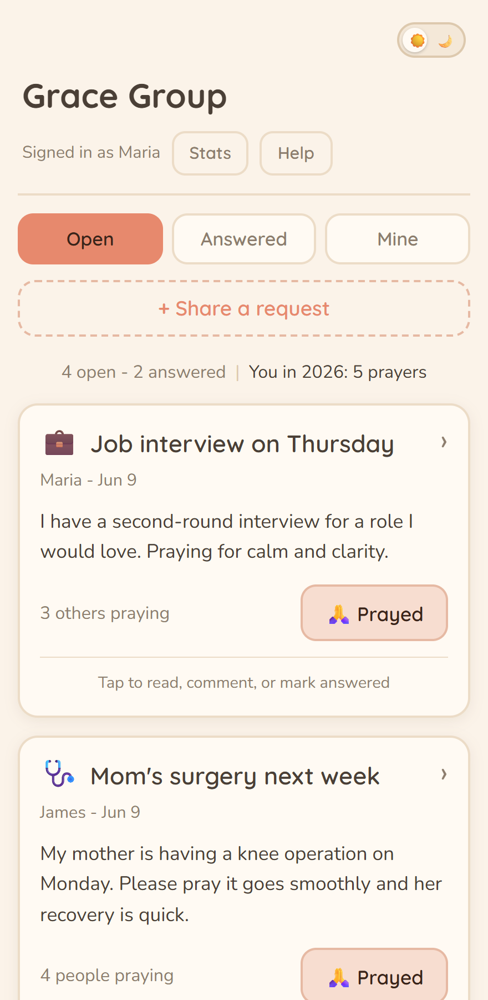
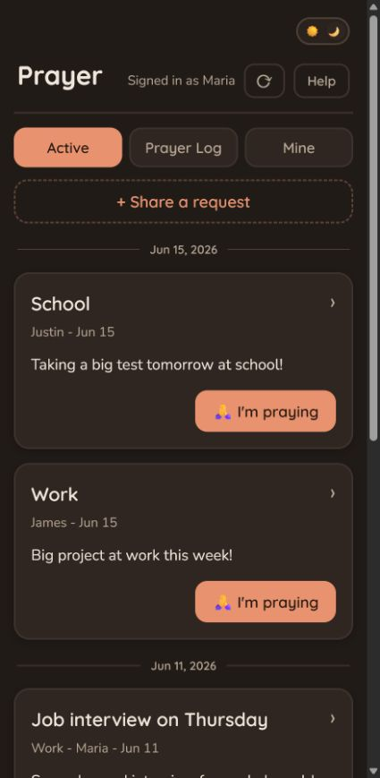

# Cenacle

A private prayer-request board for one small group, self-hosted on your own
Cloudflare account. Members log in with a personal invite link (no passwords, no
email), share requests, tap "I prayed" for each other, and keep a Prayer Log of
where requests land. Everything runs in a single Cloudflare Worker backed by D1 (SQLite), so
there's one URL, no server to babysit, and the data lives in *your* account, not
anyone else's.

> **Decentralized by design.** Every group runs its own isolated instance. There
> is no shared server and no operator who can see your data. You deploy it, you
> own it.

## Screenshots

| Light | Dark |
|---|---|
|  |  |

## Features

- **Per-person invite codes** - each member gets a unique link; no passwords or
  email. Revoke or reissue access in one command.
- **Active / Prayer Log / Mine feeds** - browse current requests, look back on
  the ones that have closed, and find your own.
- **"I prayed" taps** - let people know they're being prayed for, with simple
  counts.
- **Prayer Log** - move a request out of the active list with a closing note (a
  final update, praise report, or reason it no longer needs to stay active).
- **Updates thread** - add follow-ups to a request over time.
- **Admin stats & moderation** - a group overview and the ability to remove any
  post.
- **Light & dark mode** with three color palettes (warm, cool, neutral).
- **Installable** - "Add to Home Screen" on phones for an app-like experience.
- **Private by default** - `noindex`, no trackers, no third-party calls.

## Deploy your own (~15 minutes)

You need a [Cloudflare account](https://dash.cloudflare.com/sign-up) (the free
tier is plenty) and [Node.js](https://nodejs.org/) installed.

1. **Clone and install:**
   ```
   git clone https://github.com/your-username/cenacle.git
   cd cenacle
   npm install
   ```

2. **Create your database** and paste the printed `database_id` into
   `wrangler.jsonc` (replacing the existing one):
   ```
   npx wrangler d1 create cenacle_db
   ```

3. **Apply the schema:**
   ```
   npx wrangler d1 migrations apply cenacle_db --remote
   ```

4. **Set the session secret** (any long random string; it's never committed):
   ```
   npx wrangler secret put SESSION_SECRET
   ```

5. **Name your group.** Edit the `vars` block in `wrangler.jsonc`:
   ```jsonc
   "vars": {
     "GROUP_NAME": "Grace Group",
     "THEME": "warm"
   }
   ```
   Optionally drop your own square image in at `public/icon.jpg`.

6. **Deploy** and note the live URL it prints:
   ```
   npm run deploy
   ```

7. **Add your people** and hand out their invite links (names after `--admin`,
   up to `--`, become admins):
   ```
   node scripts/seed-members.mjs --remote --url https://your-app.workers.dev --admin "You" -- "Alice" "Bob"
   ```
   Each person gets a `?code=...` link. Copy them when they print - the raw codes
   are never stored (only their SHA-256 hashes go into the database).

That's it. Send each member their link; tapping it logs them in.

> Using a custom domain instead of `*.workers.dev` is optional - add it in the
> Cloudflare dashboard under your Worker's settings. The default workers.dev
> subdomain works with zero DNS setup.

## Configuration reference

Everything an admin configures lives in two places:

| What | Where | Notes |
|---|---|---|
| `GROUP_NAME` | `wrangler.jsonc` `vars` | Title, manifest, onboarding, invite copy. |
| `THEME` | `wrangler.jsonc` `vars` | `warm` (default), `cool`, or `neutral`. Sets both light and dark palettes. |
| App icon | `public/icon.jpg` | Replace with your own square image. |
| `SESSION_SECRET` | `wrangler secret put` | HMAC signing key. A real secret, never in the repo. |
| `database_id` | `wrangler.jsonc` `d1_databases` | From `wrangler d1 create`. |

Change a value, run `npm run deploy`, done - there's no build step or framework.
(Changing *data* like members or posts takes effect instantly; only code or
config changes need a redeploy.)

## Local development

```
cp .dev.vars.example .dev.vars              # then set SESSION_SECRET
npx wrangler d1 migrations apply cenacle_db --local
node scripts/seed-members.mjs --admin "You" # prints a local invite link
npm run dev
```

`npm run dev` serves the whole app (page + API) from one local URL. Open that URL
with the `?code=...` link from the seed step to log in. Use the dev URL, not an
editor's static preview, which bypasses the Worker.

## Documentation

- **[ADMIN.md](ADMIN.md)** - day-to-day tasks: add/remove members, reset codes,
  moderate posts, back up the database, year-end review.
- **[SECURITY.md](SECURITY.md)** - the trust model, how auth and anonymity work,
  and how to report a vulnerability.
- **[CONTRIBUTING.md](CONTRIBUTING.md)** - run it locally, code style, and scope.

## Tech

Cloudflare Workers (single-origin: API + static assets), D1 (SQLite), and a
dependency-free vanilla-JS frontend. No build step, no framework.

## License

[MIT](LICENSE)
